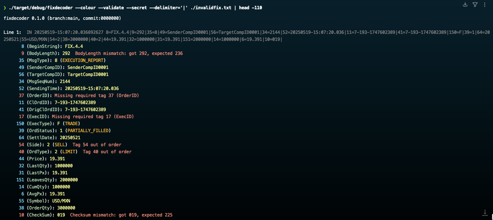

---

[](https://github.com/stephenlclarke/fixdecoder_go/actions/workflows/ci.yml)
[](https://sonarcloud.io/summary/new_code?id=stephenlclarke_fixdecoder_go)
[](https://sonarcloud.io/summary/new_code?id=stephenlclarke_fixdecoder_go)
[](https://sonarcloud.io/summary/new_code?id=stephenlclarke_fixdecoder_go)
[](https://sonarcloud.io/summary/new_code?id=stephenlclarke_fixdecoder_go)
[](https://sonarcloud.io/summary/new_code?id=stephenlclarke_fixdecoder_go)
[](https://sonarcloud.io/summary/new_code?id=stephenlclarke_fixdecoder_go)
[](https://sonarcloud.io/summary/new_code?id=stephenlclarke_fixdecoder_go)
[](https://sonarcloud.io/summary/new_code?id=stephenlclarke_fixdecoder_go)
[](https://sonarcloud.io/summary/new_code?id=stephenlclarke_fixdecoder_go)
[](https://sonarcloud.io/summary/new_code?id=stephenlclarke_fixdecoder_go)
[](https://sonarcloud.io/summary/new_code?id=stephenlclarke_fixdecoder_go)


---

# Steve's FIX Decoder / logfile prettify utility

This is my Go implementation of an "all-singing / all-dancing" utility to pretty-print logfiles containing FIX Protocol messages while experimenting with a compact native Go command-line shape and trying to incorporate SonarQube Code Quality metrics.

I have written utilities like this in past in [Java](https://github.com/stephenlclarke/fixdecoder_java), Python, C, C++, [go](https://github.com/stephenlclarke/fixdecoder_go) and even in Bash/Awk!! Rust remains my favourite, but this Go version is the small native implementation that helped shape the later [Rust](https://github.com/stephenlclarke/fixdecoder_rs) and [Java](https://github.com/stephenlclarke/fixdecoder_java) versions.



---

<p align="center">
  <a href="https://buy.stripe.com/8x23cvaHjaXzdg30Ni77O00">
    
  </a>
  &nbsp;
  <a href="https://github.com/stephenlclarke/fixdecoder_go/discussions">
    
  </a>
</p>

<p align="center">
  <sub>☕ If you found this project useful, consider buying me a coffee or dropping a comment — it keeps the caffeine and ideas flowing! 😄</sub>
</p>

---

## What is it

fixdecoder is a FIX-aware logfile prettifier and dictionary explorer. It reads stdin or one or more log files, detects FIX messages in each line, prints the original line, and follows it with a colourised tag breakdown using embedded FIX dictionaries or a supplied QuickFIX XML dictionary. For lookup work, `--info`, `--message`, `--component`, and `--tag` inspect the selected FIX version without decoding a log stream.

This Go implementation is intentionally simpler than the [Rust](https://github.com/stephenlclarke/fixdecoder_rs) and [Java](https://github.com/stephenlclarke/fixdecoder_java) repos. It focuses on fast native builds, embedded dictionary lookup, command-line dictionary browsing, and straightforward logfile prettification.

## Quick start

```bash
make build

# Stream and prettify stdin
cat fixlog.txt | scripts/fixdecoder

# Decode one or more files
scripts/fixdecoder logs/fix.log logs/fix2.log

# Browse dictionary definitions
scripts/fixdecoder --fix=44 --message=D --verbose --column --header --trailer
```

## Running the fixdecoder utility

You can run fixdecoder anywhere you can run a Go binary. The standard build embeds FIX dictionaries for FIX 4.0 through FIX 5.0 SP2 plus FIXT 1.1, and `--xml` can point at an alternative QuickFIX XML file for custom dictionaries.

From a source checkout, `scripts/fixdecoder` runs the local `bin/fixdecoder` produced by `make build`; set `FIXDECODER_BIN=/path/to/fixdecoder` to override discovery.

<!-- regen-readme:start --section=usage -->

## Full Usage

The text below is generated by running this implementation's `fixdecoder --help`.

```text
fixdecoder v1.0.0 (branch:main, commit:fb6b474) [go:go1.26.4]

  git clone https://github.com/stephenlclarke/fixdecoder_go.git

Usage: fixdecoder [--xml=FILE] [--fix=VERSION] [--info] [--message[=MSG]]
       [--component[=NAME]] [--tag[=TAG]] [--column] [--verbose] [--header]
       [--trailer] [-h|--help] [-v|--version] [file1.log file2.log ...]

Pretty-print FIX log messages and inspect FIX dictionaries.

Arguments:
  file1.log file2.log ...
      FIX log files, or stdin when omitted.

Options:
  --xml=FILE               Path to alternative FIX XML file.
  --fix=VERSION            FIX version to use.
  --info                   Show XML schema summary.
  --message[=MSG]          Message name or MsgType; omit the value to list all messages.
  --component[=NAME]       Component to display; omit the value to list all components.
  --tag[=TAG]              Tag number to display details for; omit the value to list all tags.
  --column                 Display enum values in columns.
  --verbose                Show full message structure with enums.
  --header                 Include the Header block.
  --trailer                Include the Trailer block.
  -h, --help               Show this help message and exit.
  -v, --version            Print version information and exit.

Command line option examples:

  FIX dictionary lookup

    Query FIX dictionary contents by FIX Message Name or MsgType:

      fixdecoder [[--xml=FILE] [--fix=44]]
                 --message[=NAME|MSGTYPE]
                 [--column] [--verbose] [--header] [--trailer]

      $ fixdecoder --message=NewOrderSingle --verbose --column --header --trailer
      $ fixdecoder --message=D --verbose --column --header --trailer

    Query FIX dictionary contents by FIX Tag number:

      fixdecoder [[--xml=FILE] [--fix=44]]
                 --tag[=TAG]
                 [--column] [--verbose]

      $ fixdecoder --tag=44 --verbose --column

    Query FIX dictionary contents by FIX Component Name:

      fixdecoder [[--xml=FILE] [--fix=44]]
                 --component[=NAME]
                 [--column] [--verbose]

      $ fixdecoder --component=Instrument --verbose --column

  Show summary information about the selected FIX dictionary:

    fixdecoder [[--xml=FILE] [--fix=44]]
               --info

    $ fixdecoder --info

  Prettify FIX log files:

    fixdecoder [--xml=FILE] [--fix=VERSION]
               [--column] [--verbose] [--header] [--trailer]
               [file1.log file2.log ...]

    Force the decoding of a FIX log to use the FIX 4.4 dictionary.

    $ fixdecoder --fix=44 trades.log

    Decode stdin using a custom FIX XML dictionary:

    $ cat logs/fix.log | fixdecoder --xml=resources/FIX44.xml --fix=44

    Show the full help or version details:

    $ fixdecoder --help
    $ fixdecoder --version
```

<!-- regen-readme:end --section=usage -->

## Key options at a glance

- Dictionaries: `--xml`, `--fix`, `--info`, `--message`, `--component`, `--tag`
- Output/layout: `--column`, `--verbose`, `--header`, `--trailer`
- Input: one or more log files, or stdin when no file is supplied

<!-- regen-readme:start --section=capabilities -->

## Generated Capability Snapshot

This snapshot is generated by `make regen-readme` by running this implementation's binary and reflects the options and dictionary surface currently available in this repository.

- Supported long options: `--column`, `--component`, `--fix`, `--header`, `--help`, `--info`, `--message`, `--tag`, `--trailer`, `--verbose`, `--version`, `--xml`
- Sample message discovered from the dictionary: `NewOrderSingle (D)`
- Sample component discovered from the dictionary: `PreAllocGrp`
- Sample repeating group tag discovered from the dictionary: `NoPartyIDs (453)`

```bash
$ scripts/fixdecoder --fix=44 --message=D --column
Message: NewOrderSingle (D)
    Message: Body
          11: ClOrdID (STRING) - (Y)
         526: SecondaryClOrdID (STRING)
         583: ClOrdLinkID (STRING)
   Component: Parties
         453: NoPartyIDs (NUMINGROUP)
               448: PartyID (STRING)
               447: PartyIDSource (CHAR)
               452: PartyRole (INT)
         Component: PtysSubGrp
               802: NoPartySubIDs (NUMINGROUP)
                     523: PartySubID (STRING)
                     803: PartySubIDType (INT)
         229: TradeOriginationDate (LOCALMKTDATE)
          75: TradeDate (LOCALMKTDATE)
           1: Account (STRING)
         660: AcctIDSource (INT)
...
```

```bash
$ scripts/fixdecoder --fix=44 --component=PreAllocGrp --column
Component: PreAllocGrp
      78: NoAllocs (NUMINGROUP)
            79: AllocAccount (STRING)
           661: AllocAcctIDSource (INT)
           736: AllocSettlCurrency (CURRENCY)
           467: IndividualAllocID (STRING)
     Component: NestedParties
           539: NoNestedPartyIDs (NUMINGROUP)
                 524: NestedPartyID (STRING)
                 525: NestedPartyIDSource (CHAR)
                 538: NestedPartyRole (INT)
           Component: NstdPtysSubGrp
                 804: NoNestedPartySubIDs (NUMINGROUP)
                       545: NestedPartySubID (STRING)
                       805: NestedPartySubIDType (INT)
            80: AllocQty (QTY)
```

```bash
$ scripts/fixdecoder --fix=44 --tag=453 --verbose --column
 453: NoPartyIDs (NUMINGROUP)
```

<!-- regen-readme:end --section=capabilities -->

<!-- regen-readme:start --section=examples -->

## Generated CLI Examples

These examples are generated by `make regen-readme` using the Go command-line application.

### `stdin`

```bash
$ printf '<FIX log>' | scripts/fixdecoder
Processing: (stdin)

8=FIX.4.4|9=22|35=0|49=BUY1|56=SELL1|10=168|
    8 (BeginString): FIX.4.4
    9 (BodyLength): 22
    35 (MsgType): 0 (Heartbeat)
    49 (SenderCompID): BUY1
    56 (TargetCompID): SELL1
    10 (CheckSum): 168
```

### `--info`

```bash
$ scripts/fixdecoder --info
Available FIX Dictionaries: 40,41,42,43,44,50,50SP1,50SP2,T11
Current Schema:
  FIX Version:  4.4
  Service Pack: 0
  Messages:     93
  Components:   106
  Fields:       912
```

### `--message`

```bash
$ scripts/fixdecoder --fix=44 --message=D --column
Message: NewOrderSingle (D)
    Message: Body
          11: ClOrdID (STRING) - (Y)
         526: SecondaryClOrdID (STRING)
         583: ClOrdLinkID (STRING)
   Component: Parties
         453: NoPartyIDs (NUMINGROUP)
               448: PartyID (STRING)
               447: PartyIDSource (CHAR)
               452: PartyRole (INT)
         Component: PtysSubGrp
               802: NoPartySubIDs (NUMINGROUP)
                     523: PartySubID (STRING)
                     803: PartySubIDType (INT)
         229: TradeOriginationDate (LOCALMKTDATE)
          75: TradeDate (LOCALMKTDATE)
           1: Account (STRING)
         660: AcctIDSource (INT)
         581: AccountType (INT)
         589: DayBookingInst (CHAR)
         590: BookingUnit (CHAR)
         591: PreallocMethod (CHAR)
          70: AllocID (STRING)
   Component: PreAllocGrp
          78: NoAllocs (NUMINGROUP)
                79: AllocAccount (STRING)
...
```

### `--component`

```bash
$ scripts/fixdecoder --fix=44 --component=PreAllocGrp --column
Component: PreAllocGrp
      78: NoAllocs (NUMINGROUP)
            79: AllocAccount (STRING)
           661: AllocAcctIDSource (INT)
           736: AllocSettlCurrency (CURRENCY)
           467: IndividualAllocID (STRING)
     Component: NestedParties
           539: NoNestedPartyIDs (NUMINGROUP)
                 524: NestedPartyID (STRING)
                 525: NestedPartyIDSource (CHAR)
                 538: NestedPartyRole (INT)
           Component: NstdPtysSubGrp
                 804: NoNestedPartySubIDs (NUMINGROUP)
                       545: NestedPartySubID (STRING)
                       805: NestedPartySubIDType (INT)
            80: AllocQty (QTY)
```

### `--tag`

```bash
$ scripts/fixdecoder --fix=44 --tag=453 --verbose --column
 453: NoPartyIDs (NUMINGROUP)
```

<!-- regen-readme:end --section=examples -->

<!-- regen-readme:start --section=build-examples -->

## Build it

Build it from source. This requires `bash` and a recent Go toolchain.

```bash
❯ bash --version
GNU bash, version 5.3.15(1)-release (aarch64-apple-darwin25.4.0)
Copyright (C) 2025 Free Software Foundation, Inc.
License GPLv3+: GNU GPL version 3 or later <http://gnu.org/licenses/gpl.html>
```

```bash
❯ go version
go version go1.26.4 darwin/arm64
```

Clone the git repo.

```bash
❯ git clone git@github.com:stephenlclarke/fixdecoder_go.git
Cloning into 'fixdecoder_go'...
...
❯ cd fixdecoder_go
```

Then build it. Local builds compile the binary and run the test suites used by CI.

```bash
❯ make build unit-test integration-test

>> Setting up environment
>> Running go mod tidy in all modules
>> Building the application
>> Running unit tests
>> Running integration tests
```

Build all release-style fixdecoder binaries.

```bash
❯ make build-all

>> Building for OS: darwin, ARCH: arm64
>> Building for OS: linux, ARCH: arm64
>> Building for OS: linux, ARCH: amd64
>> Building for OS: windows, ARCH: amd64
```

Run it (from the release build) and check the version details:

```bash
❯ ./bin/fixdecoder --version
fixdecoder v1.0.0 (branch:main, commit:fb6b474) [go:go1.26.4]
```

Run the same build through the source-checkout wrapper:

```bash
❯ scripts/fixdecoder --version
fixdecoder v1.0.0 (branch:main, commit:fb6b474) [go:go1.26.4]
```

<!-- regen-readme:end --section=build-examples -->

## Development

The local workflow uses Go and the repo's `ci.sh` wrapper.

```bash
make build
make unit-test
make integration-test
make scan
go test ./... -cover
```

The FIX dictionary Go source is regenerated from the XML resources with:

```bash
./resources/generate_fix_go.sh
```

## Related implementations

- [fixdecoder_rs](https://github.com/stephenlclarke/fixdecoder_rs) is the Rust version and remains my favourite.
- [fixdecoder_java](https://github.com/stephenlclarke/fixdecoder_java) is the Java version with object-oriented internals, Maven, JaCoCo coverage, and Java CI/CD.

## License

Project source is released under the GNU Affero General Public License v3.0 only (`AGPL-3.0-only`). Maintained source files carry SPDX headers:

```text
SPDX-License-Identifier: AGPL-3.0-only
SPDX-FileCopyrightText: 2026 Steve Clarke <stephenlclarke@mac.com> - https://xyzzy.tools
```

The embedded FIX dictionary packages are generated from QuickFIX FIX XML specifications. Those QuickFIX materials remain under the BSD 2-Clause “Simplified” License; see `NOTICE.md` for the retained attribution text and compatibility note.
